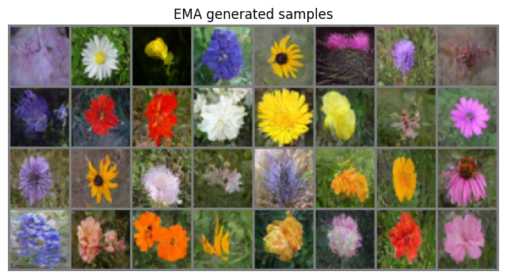
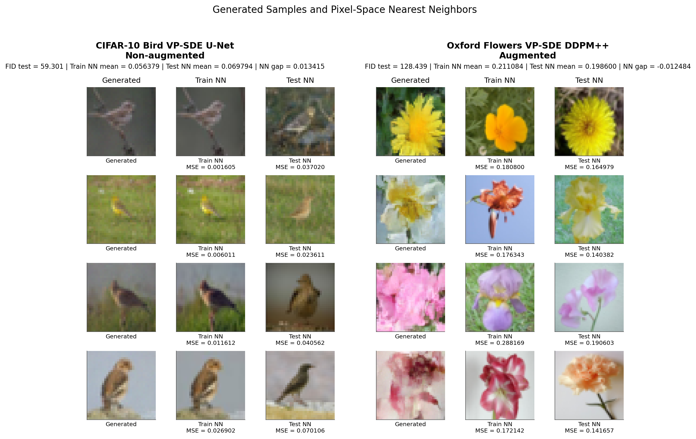

# Reproducing Score-Based Diffusion Models

<p align="center">
  
</p>

The original paper, Song et al.'s *Score-Based Generative Modeling through
Stochastic Differential Equations*, trains on large-scale datasets,
high-capacity models, and thousands of sampling steps. Our setup was
considerably more constrained. Rather than aim to match their results 
directly, we used that constraint to investigate how much of the 
framework's behavior holds up under a substantially reduced budget.

The full report is [here](./report/report.pdf).

## Overview

- Implemented continuous denoising score matching, reverse-time SDE
  simulation, Euler-Maruyama sampling, Langevin correction, checkpointing,
  and EMA weights.
- Trained and evaluated 8 conditions: four dataset/model/SDE setups, with
  and without augmentation.
- Compared a custom 62.14M-parameter U-Net against DDPM++ and NCSN++
  backbones adapted from `score_sde_pytorch`.
- Generated CIFAR-10 Birds at 32×32 and Oxford Flowers 102 at 48×48.
- Evaluated every model with 2048-feature FID and nearest-neighbor pixel
  MSE against both train and test splits.
- Tested augmentation, raw vs. EMA weights, 100–1000 sampling steps, and
  0–4 corrector steps.

## The setup

Two SDE families, variance-preserving (VP) and variance-exploding (VE),
across three score-network backbones and two datasets, with and without
augmentation. Eight trained configurations in total.

| Dataset | Backbone | SDE | Params | Resolution | Train / Test |
|---|---|---|---|---|---|
| CIFAR-10 Bird | U-Net (custom) | VP | 62.14M | 32×32 | 5,000 / 1,000 |
| CIFAR-10 Bird | DDPM++ | VP | 10.09M | 32×32 | 5,000 / 1,000 |
| CIFAR-10 Bird | NCSN++ | VE | 62.76M | 32×32 | 5,000 / 1,000 |
| Oxford Flowers 102 | DDPM++ | VP | 9.89M | 48×48 | 1,020 / 6,198 |

Training setup:
- DDPM++ and NCSN++ adapted from `score_sde_pytorch`; U-Net is a
  from-scratch encoder-decoder baseline.
- AdamW, lr 1e-4, batch size 128, 1,760 epochs.
- EMA copy of the weights tracked alongside the raw ones throughout.

## The numbers

Test-set FID and the nearest-neighbor gap (mean pixel-MSE distance to the
nearest *test* image minus the nearest *train* image). Positive means
generated samples sit closer, on average, to what the model trained on:

| Dataset | Backbone | SDE | Aug. | Test FID ↓ | NN gap |
|---|---|---|---|---|---|
| CIFAR-10 Bird | U-Net | VP | No | **59.30** | 0.01342 |
| CIFAR-10 Bird | U-Net | VP | Yes | 71.56 | 0.00203 |
| CIFAR-10 Bird | DDPM++ | VP | No | 63.18 | 0.00318 |
| CIFAR-10 Bird | DDPM++ | VP | Yes | 73.85 | **0.00040** |
| CIFAR-10 Bird | NCSN++ | VE | No | 62.95 | 0.00227 |
| CIFAR-10 Bird | NCSN++ | VE | Yes | 68.88 | 0.00088 |
| Oxford Flowers | DDPM++ | VP | No | 96.01 | 0.01927 |
| Oxford Flowers | DDPM++ | VP | Yes | 128.44 | -0.01248 |

## Quality vs. Memorization Trade-off

<p align="center">
  
</p>

Left column: generated. Middle: nearest train. Right: nearest test. The
non-augmented U-Net's samples are nearly identical to train (MSE as low as
0.0016). The augmented Oxford Flowers model sits far from both.

- EMA improved FID across the board. The best FID overall, 52.12, came
  from the non-augmented VP U-Net with EMA. That same model had the
  largest NN gap in the study, meaning many of its "generated" birds
  were near-copies of training images.
- Augmentation pushed samples away from train (NCSN++ mean NN MSE roughly
  doubled) but had mixed effects on FID, better for NCSN++, worse for
  DDPM++ and the U-Net.
- Best practical trade-off: the augmented VE-SDE NCSN++ with EMA, FID 58.32,
  without the memorization red flag.

## Corrector-Step Ablation

<p align="center">
  
</p>

Standard sampling here used 1,000 Euler-Maruyama predictor steps. We also
tried adding 1-4 Langevin corrector steps on top, to see if it would sharpen
results.

| Corrector steps | Test FID ↓ | NN gap  |
|---|---|---|
| 0 | **59.30** | 0.01342 |
| 1 | 61.20 | 0.01174 |
| 2 | 60.64 | 0.01189 |
| 3 | 60.87 | **0.01173** |
| 4 | 60.32 | 0.01479 |

## Notebooks

| What it covers | Notebook(s) |
|---|---|
| FID + memorization aggregation, corrector-step ablation | `evaluation_fid_memorization.ipynb` |
| Sampling-step sweep, 100–1000 steps | `raw_sampling_step_sweep.ipynb` |
| VE-SDE / NCSN++, Birds | `ve_sde_bird_ncsnpp_non_augmented.ipynb`, `ve_sde_bird_ncsnpp_augmented.ipynb` |
| VP-SDE / DDPM++, Birds | `vp_sde_bird_ddpmpp_non_augmented.ipynb`, `vp_sde_bird_ddpmpp_augmented.ipynb` |
| VP-SDE / U-Net, Birds | `vp_sde_bird_unet_non_augmented.ipynb`, `vp_sde_bird_unet_augmented.ipynb` |
| VP-SDE / DDPM++, Flowers | `vp_sde_flowers_ddpmpp_non_augmented.ipynb`, `vp_sde_flowers_ddpmpp_augmented.ipynb` |

Notebooks run on Colab with a GPU runtime and Drive mounted. Update the
Drive path near the top if yours differs. DDPM++ and NCSN++ notebooks also
pull in `score_sde_pytorch` during setup.

## Repo layout

```
.
├── assets/       # Images used in this README
├── notebooks/    # The 10 notebooks above
├── report/       # Full report
├── results/      # Per-run FID + memorization logs
├── src/          # Shared SDE kernels, configs, EMA, plotting helpers
├── requirements.txt
└── README.md
```

## Limitations

- Compute-limited reproduction, not a state-of-the-art result.
- The eight runs vary in more than one way at once. For example, the two
  VP-SDE models differ a lot in size (10M vs. 62M parameters), so the
  effects of model size and SDE type aren't fully separated.
- FID should always be read alongside the nearest-neighbor scores, not
  on its own.
- Full math, the sampling algorithm, and more result images are in the
  report.
